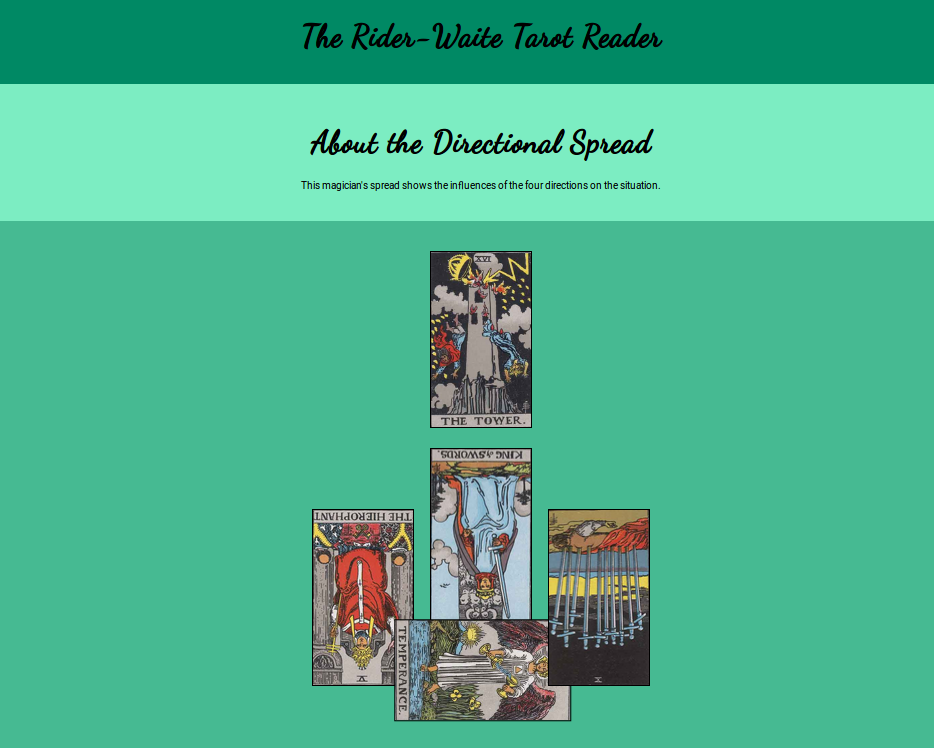
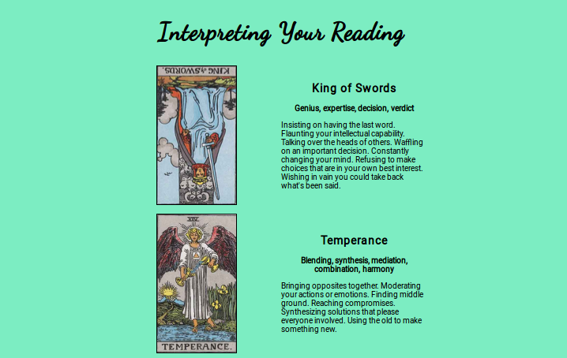

# Rider-Waite Tarot Reader React App
Get a unique tarot reading in one of five spreads on desktop, tablet, and phone.

This is a single page React application which uses  

## Usage

&raquo; The live demo has been removed. 

To run this app, clone the repository:

```
git clone git@github.com:wicker/Rider-Waite-Reader.git
```

Then cd into the app directory to install and start it.

```
cd Rider-Waite-Reader/rider-waite-reader
npm install
npm start
```

Starting the app should automatically open a browser window. If it doesn't, visit [http://localhost:3000/](http://localhost:3000/).

## Screenshots





## Credits

The tarot images are of the Rider-Waite-Smith deck from sacred-tarot and are in the public domain.

By Authorship: <a href="//en.wikipedia.org/wiki/Arthur_Edward_Waite" class="mw-redirect" title="Arthur Edward Waite">Arthur Edward Waite</a>, <a href="//en.wikipedia.org/wiki/Pamela_Coleman_Smith" class="mw-redirect" title="Pamela Coleman Smith">Pamela Coleman Smith</a> was the artist and worked as an artist 'for hire.' Waite was the copyright holder and he died in 1942. - This image scanned by <a rel="nofollow" class="external text" href="http://home.comcast.net/~vilex/">Holly Voley</a>,
<a href="//en.wikipedia.org/wiki/File:Cups01.jpg" title="Public domain in the United States">PD-US</a>, <a href="https://en.wikipedia.org/w/index.php?curid=35262364">Link</a>

The tarot card meanings are taken from <a href="http://tarottools.com/a-guide-to-tarot-card-meanings/">A Guide to Tarot Card Meanings</a> by Mark McElroy, which he explicitly released into the public domain.

